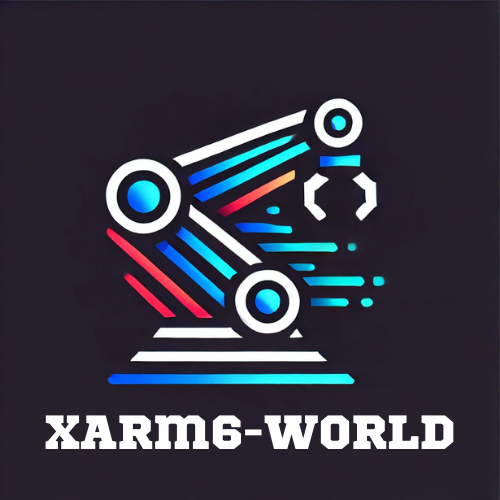
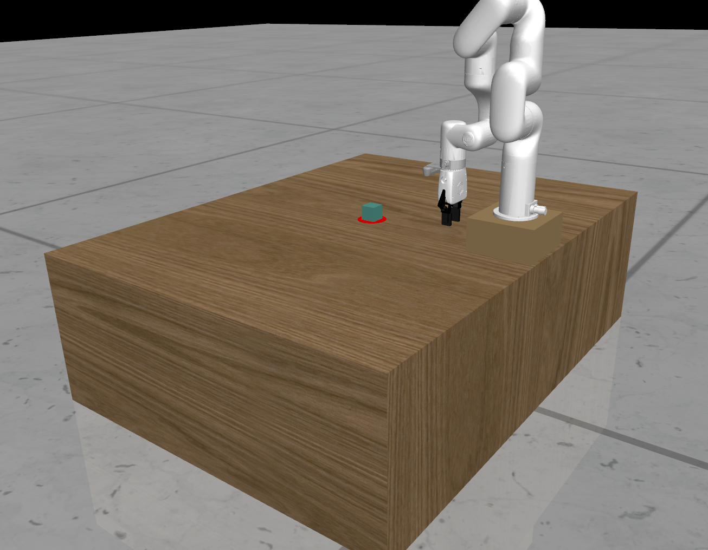
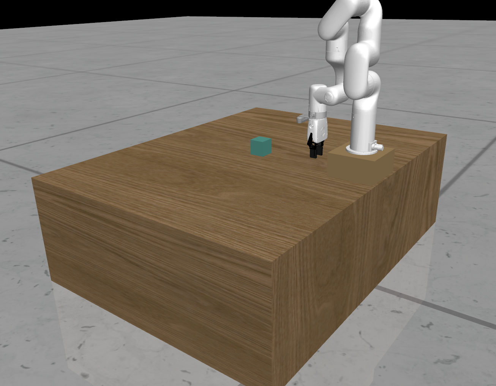
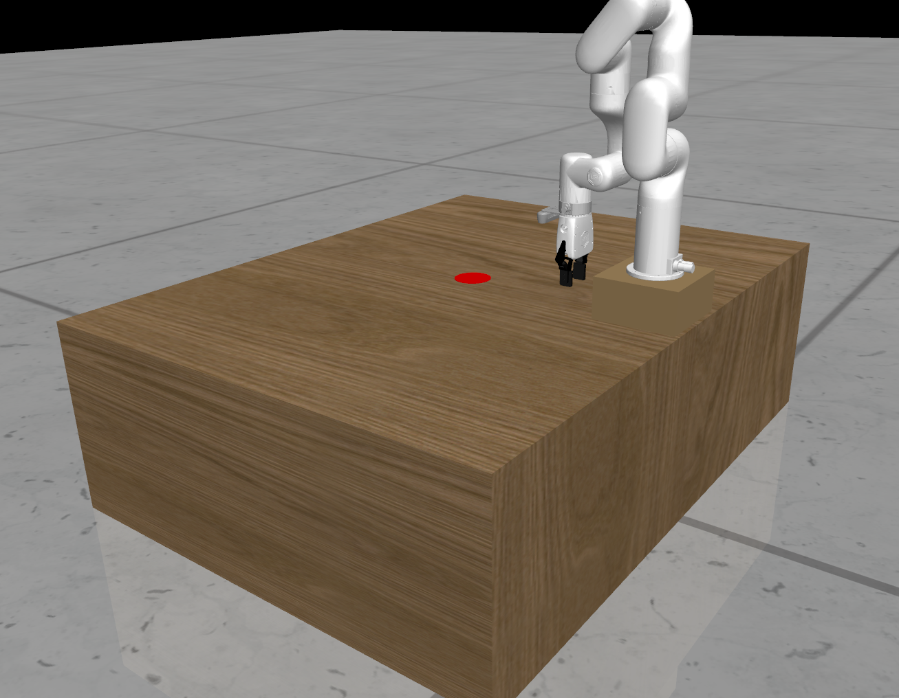
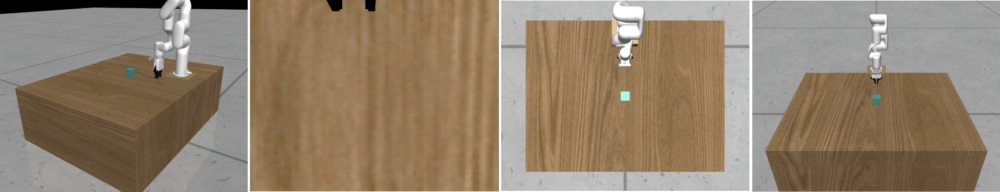

# xArm6-World

xArm6-World is a simulation environment for reinforcement learning (RL) tasks, designed based on MuJoCo and Gym APIs, providing an easy-to-use interface to control the xArm6 robotic arm for a variety of tasks.

<!-- PROJECT LOGO -->
<br />

<p align="center">
  <a href="https://github.com/OwenCaleb/xArm6-World.git/">
    
  </a>

</p>

## Content

- [Installation](#Installation)
- [Usage](#Usage)
  - [Parameters](#Parameters)

- [Tasks](#Tasks)
- [Features](#Features)
- [Quickstart](#Quickstart)
- [Author](#Author)
- [Acknowledgements](#Acknowledgements)

### Installation

The package can be installed using pip:

```sh
pip install git+https://github.com/OwenCaleb/xArm6-World.git/@main#egg=xarm6world
```

Alternatively, you can clone the repository and install an editable version locally:

```
git clone git@github.com:OwenCaleb/xArm6-World.git
cd xArm6-World
pip install -e .
```

Most dependencies should be installed automatically. However, you may need to install [MuJoCo 2.1.0](https://github.com/deepmind/mujoco/releases/tag/2.1.0) if you do not already have it installed. To install MuJoCo, download it on the link above and make sure it is located at `~/.mujoco/mujoco210`. Then, add the following lines to your `~/.bashrc` file:

```
export LD_LIBRARY_PATH=$LD_LIBRARY_PATH:~/.mujoco/mujoco210/bin
```

and similarly place your MuJoCo license key at `~/.mujoco/mjkey.txt`.

### Usage
The package provides an API for controlling the xArm6 simulation environment. The environment can be initialized as follows:

```
import xarm6world  

params = {
    'task': 'push',
    'max_episode_steps': 100,
    'repeat': 2,
    'obs_mode': 'rgb',
    'obs_size': 84,
    'render_size': 224,
    'frame_stack': 1,
    'channel_last': False,
    'xarm_camera_mode': 'mode2',
    'action_control_mode': 'simple',
    'render_mode': 'human'
}

env=make_env(params)
```

#### Parameters

Below is a description of the parameters that can be configured when creating the environment. These parameters allow for full customization of the `xArm6-World` environment based on your needs, whether you want high-quality visual observations, control over the robot’s actions, or more detailed camera configurations.

##### `task`
- **Type**: `str`
- **Description**: Specifies the task to be performed. Tasks example:
  - `'push'`: Pushing an object to a target position.
  - Other tasks may be available depending on the environment configuration.

##### `max_episode_steps`
- **Type**: `int`
- **Description**: The maximum number of steps allowed in each episode. Once this number of steps is reached, the episode ends.

##### `repeat`
- **Type**: `int`
- **Description**: The number of times to repeat an action during each step. This can be useful for action smoothing or for tasks that require precise movements.

##### `obs_mode`
- **Type**: `str`
- **Description**: The mode in which observations are provided.
  - `'state'`: State-based observation, including joint positions, velocities, etc.
  - `'rgb'`: RGB images of the scene, along with the robot's state information, including the gripper's position, orientation (quaternion, if `action_control_mode` is set to 'complex'), and the gripper's opening state.
  - `'depth'`: Depth images of the scene, along with the robot's state information, including the gripper's position, orientation (quaternion, if `action_control_mode` is set to 'complex'), and the gripper's opening state.
  - `'all'`: A combination of RGB images and Depth images, along with the robot's state information, including the gripper's position, orientation (quaternion, if `action_control_mode` is set to 'complex'), and the gripper's opening state.

##### `obs_size`
- **Type**: `int`
- **Description**: The resolution (width and height) of the observation image when using RGB-based or Depth-based observations. Typically, smaller sizes (e.g., 84) are used for reinforcement learning tasks.

##### `render_size`
- **Type**: `int`
- **Description**: The resolution (width and height) of the rendered images when displaying the environment using `env.render()`.

##### `frame_stack`
- **Type**: `int`
- **Description**: The number of frames to stack together in the observation. This is often used in reinforcement learning to provide temporal information. A value of 1 means no frame stacking.

##### `channel_last`
- **Type**: `bool`
- **Description**: If set to `True`, the observation images will follow the "channels_last" format (height, width, channels), which is commonly used in TensorFlow. If set to `False`, the format will be "channels_first" (channels, height, width), which is commonly used in PyTorch.

##### `xarm_camera_mode`
- **Type**: `str`

- **Description**: Specifies the camera mode used for capturing images from the robot's viewpoint.
  
  - `'mode1'`, `'mode2'`, etc.: Different predefined camera modes that adjust the robot's camera settings.
  
  - Adjust this parameter if you need to change the camera view in observation according to the table below.
  
  - **Note**: This is only valid when `obs_mode` includes 'image'.
  
    | **Mode** | **camera0 (remote)** | **camera1 (arm)** | **camera2 (upview)** | **camera3 (front)** |
    | -------- | -------------------- | ----------------- | -------------------- | ------------------- |
    | Mode 1   |                      | √                 |                      |                     |
    | Mode 2   | √                    |                   |                      |                     |
    | Mode 3   |                      |                   | √                    |                     |
    | Mode 4   |                      |                   |                      | √                   |
    | Mode 5   | √                    | √                 |                      |                     |
    | Mode 6   |                      | √                 | √                    |                     |
    | Mode 7   |                      | √                 |                      | √                   |
    | Mode 8   | √                    |                   | √                    |                     |
    | Mode 9   | √                    |                   |                      | √                   |
    | Mode 10  |                      |                   | √                    | √                   |
    | Mode 11  | √                    | √                 | √                    |                     |
    | Mode 12  | √                    | √                 |                      | √                   |
    | Mode 13  |                      | √                 | √                    | √                   |
    | Mode 14  | √                    |                   | √                    | √                   |
    | Mode 15  | √                    | √                 | √                    | √                   |

##### `action_control_mode`
- **Type**: `str`
- **Description**: Defines the control mode used to send actions to the robot.
  - `'simple'`: A simpler control mode with fewer parameters (4D: `xyz` position and `w` gripper width).
  - `'complex'`: A more detailed control mode with additional parameters (8D: `xyz` position, `quat` rotation, and `w` gripper width).

##### `render_mode`
- **Type**: `str`
- **Description**: Specifies the rendering mode.
  - `'human'`: Enables interactive rendering, allowing you to visualize the environment in a window.
    - **Note**: Requires setting `export LD_PRELOAD=/usr/lib/x86_64-linux-gnu/libGLEW.so` for proper rendering.
  - `'rgb_array'`: Renders the environment and returns the image as a NumPy array, useful for processing the images programmatically.
    - **Note**: Requires unsetting `LD_PRELOAD` with `unset LD_PRELOAD` for correct behavior.

### Tasks

`xArm6-World` provides a collection of tasks that simulate robotic manipulation using the xArm6 robot. These tasks are designed to challenge reinforcement learning (RL) algorithms and provide a realistic setting for testing and training robotic agents in various manipulation scenarios. Below are the available tasks in the `xArm6-World` environment:

#### 1. **Push**

- **Objective**: The agent's goal is to push a target object to a specified location or into a goal area using the robot's end-effector (gripper). This task focuses on precision in pushing and requires fine control of the robot's arm to achieve the goal.

#### 2. **Lift**

- **Objective**: In this task, the agent must pick up an object from one location. The agent must correctly align the gripper to grasp the object and move it to the designated location.

#### 3. **Reach**

- **Objective**: The agent must reach a specified target location with the end-effector of the robot. This task is often used to evaluate the basic manipulation skills of the robot, such as moving the arm to a particular point in space.

#### 4. **Stack**

- **Objective**: The agent must stack one object on top of another using the robot's end-effector. This task evaluates the robot's advanced manipulation skills, including precise control, object handling, and spatial awareness, to achieve a stable and accurate stacked configuration.

|                                  |                                                |
| :------------------------------: | :--------------------------------------------: |
|         `xArm6Push-v0`          |                 `xArm6Lift-v0`                 |
|  |                  |
|         `xArm6Reach-v0`          |             `xArm6Stack-v0`             |
|  |  |

### Features

#### 1. **Multiple Camera Modes for Multi-View Research**

The environment offers multiple camera modes to capture images from different perspectives, enabling research on **multi-modal fusion** and **multi-view reinforcement learning**. These modes allow easy switching between various robot cameras (arm, remote, upview, and front) to study how different visual inputs affect the agent's performance.
**Note:** The camera configuration parameters are unified with the RealSense D435i.
<p align="center">
  <a href="https://github.com/OwenCaleb/xArm6-World.git/">
    
  </a>

#### 2. **Complex Control Mode (Quaternion-based Control)**

In addition to the simple control mode, the environment supports a **complex control mode** using **quaternions** for precise gripper control. This mode provides a 8D action space (pos, orientation and gripper width) for tasks that require complex rotations and accurate manipulation, while the simple mode uses a 4D action space.

#### 3. **Customizable Tasks and Scenes**
Users can customize task objectives and environmental scenes, such as different object shapes, sizes, weights, and varying task difficulties. This allows researchers to easily adjust the training environment based on specific needs for experimentation and testing.

### Quickstart

This section provides a quick guide on how to get started with the `xArm6-World` environment. You can follow these steps to run a basic example of the robot's manipulation tasks.

```
import xarm6world  
import cv2
from xarm6world import make_env

params = {
    'task': 'push',
    'max_episode_steps': 100,
    'repeat': 2,
    'obs_mode': 'rgb',
    'obs_size': 84,
    'render_size': 224,
    'frame_stack': 1,
    'channel_last': False,
    'xarm_camera_mode': 'mode2',
    'action_control_mode': 'simple',
    'render_mode': 'rgb_array'
}

env=make_env(params)

env.reset()

for step in range(10000):  
    print(f"Step {step + 1}")

    action = env.action_space.sample()
    # action = np.clip(np.array([0.005, 0.005, -0.1, 1,0, 0, 0, -1.0], dtype=np.float32), -1.0, 1.0)

    observation, reward, done, info = env.step(action) 

    rendered_image = env.render(camera_name='camera0')
    
    if params['render_mode']=='rgb_array':
       rendered_image_bgr = cv2.cvtColor(rendered_image, cv2.COLOR_RGB2BGR)
       cv2.imshow("Rendered Image", rendered_image_bgr)

    # print(f"Observation: {observation}")
    # print(f"Reward: {reward}")
    # print(f"Done: {done}")
    # print(f"Info: {info}")

    if done :
        print("Episode finished!")
        break

    if cv2.waitKey(42) & 0xFF == 27:
        print("Exited via ESC key!")
        break

env.close()
cv2.destroyAllWindows()
```

### Author

[OwenCaleb(Wenbo Li)](https://github.com/OwenCaleb?tab=repositories)

### Acknowledgements

* This repository is based on work by [Nicklas Hansen](https://nicklashansen.github.io/), [Yanjie Ze](https://yanjieze.com/), [Rishabh Jangir](https://jangirrishabh.github.io/), [Mohit Jain](https://natsu6767.github.io/), and [Sambaran Ghosal](https://github.com/SambaranRepo) as part of the following publications:
  * [Self-Supervised Policy Adaptation During Deployment](https://arxiv.org/abs/2007.04309)
  * [Generalization in Reinforcement Learning by Soft Data Augmentation](https://arxiv.org/abs/2011.13389)
  * [Stabilizing Deep Q-Learning with ConvNets and Vision Transformers under Data Augmentation](https://arxiv.org/abs/2107.00644)
  * [Look Closer: Bridging Egocentric and Third-Person Views with Transformers for Robotic Manipulation](https://arxiv.org/abs/2201.07779)
  * [Visual Reinforcement Learning with Self-Supervised 3D Representations](https://arxiv.org/abs/2210.07241)
